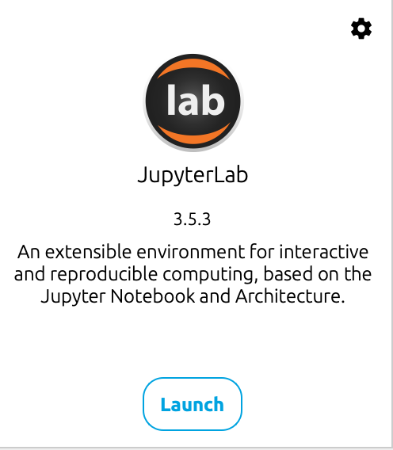

# 配置本地开发环境

## 安装 [anaconda](https://www.anaconda.com/)

作为初学者我强烈建议你安装 `anaconda`, 并且确保 它是你本地默认的 `python` 环境.

```bash
which python # 应该输出 以下内容 指向 anaconda 的安装位置
/Users/fancn/anaconda3/bin/python
```

## [jupyter notebook](https://jupyter.org/) 是你学习 python 的最佳伴侣

同样我强烈建议你的早期 python 代码都在 `jupyter notebook` 中编写, 这样可以更好的理解代码的执行过程.

## 如何运行 jupyter notebook

- jupyter notebook 可以直接通过 anaconda 里面的 `JupyterLab` 环境中运行.

  

- 亦可以直接在 vscode 中运行

  安装 `ms-toolsai.jupyter` 插件

## 🚀 you are now good to go
